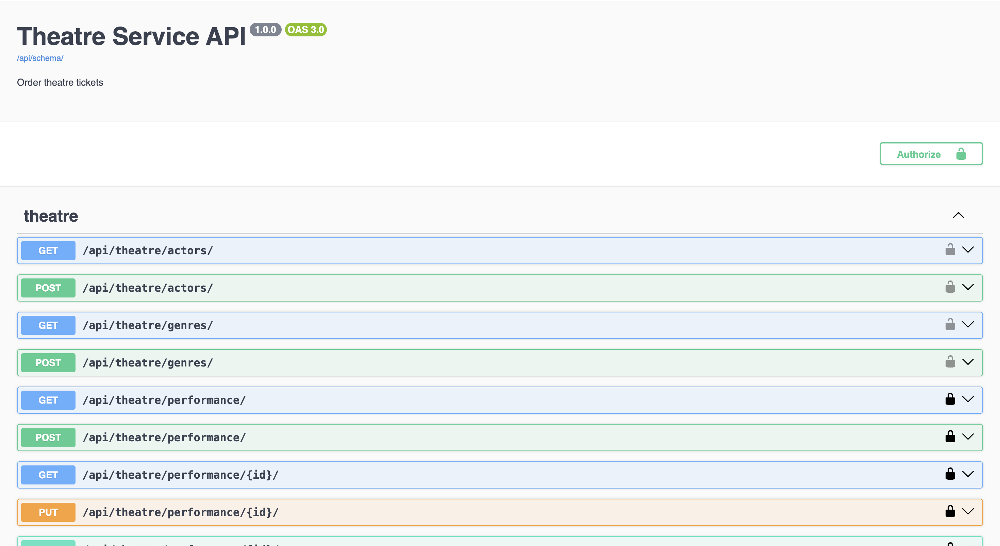
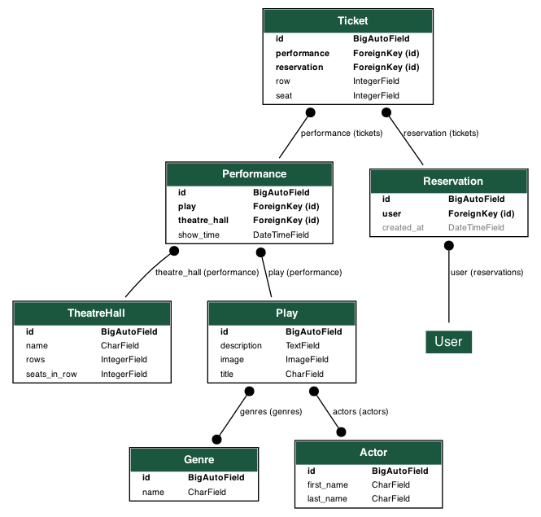

# api-theatre

An API service for theaters that enables remote seat booking.
***
 Features

- Using a JWT token
- Image uploading
- filtering by parameters 
- Pagination has been implemented.
- seat reservation with validation of already occupied seats

***

Docker installation and launch

- git clone https://github.com/spmspi/api-theatre.git
- docker-compose up --build
- Open in your browser http://localhost:8000/

Test admin user -
- Login "admin@admin.com"
- Password "123456Pp"

***

images: 

swagger

***
Diagram 
